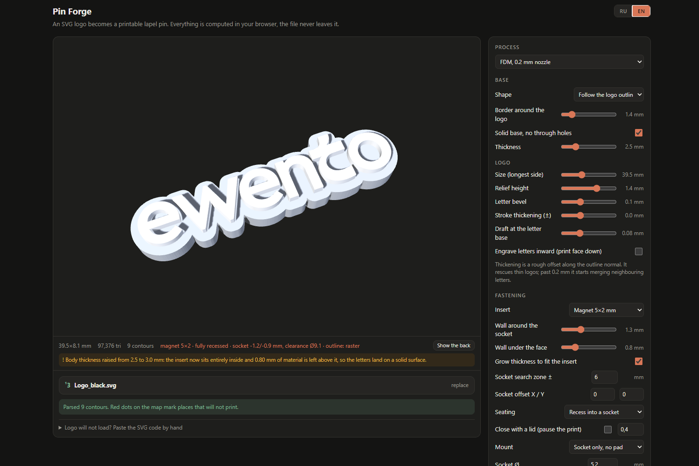
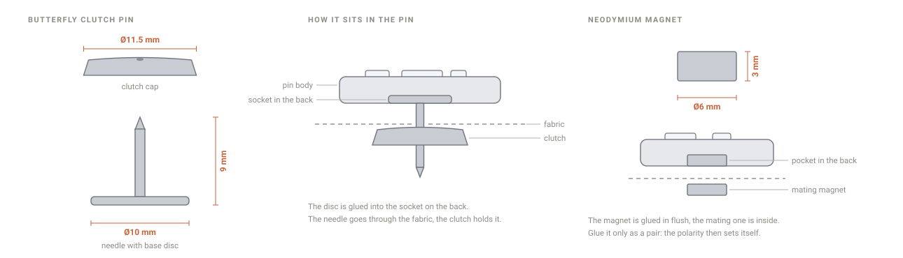

# Pin Forge

[Русская версия](README.ru.md)

Turn an SVG logo into a printable lapel pin: a binary STL, or a ready-made
Orca/Bambu project with the print profile already baked in. Everything is
computed in the browser and the file never leaves your machine.

## Try it

### → [pin.gorskikh.com](https://pin.gorskikh.com)

Nothing to install and nothing to sign up for. Drop an SVG under the preview
and the pin appears.



The interface is bilingual, English and Russian, with a switch in the header.

## What it gives you

- **A body that fits the logo** — a round disc, a rounded rectangle, or a plate
  cut to the outline of the letters themselves.
- **A socket for the hardware** — butterfly clutch pin or a magnet, recessed,
  glued onto a pad, or sunk under a printed lid with a pause in the print.
- **A printability check** — the thinnest stroke and the narrowest gap are
  measured against the selected process, with a map of the spots that will not
  come out and concrete advice on how to fix them.
- **A test tile** — a 3×3 grid across logo sizes and relief heights, so one
  print tells you which combination survives.

## The hardware at the back



The generator sizes the socket for whichever of these you pick, finds the spot
closest to the centre where it actually fits, and warns you when it does not.

## SVG requirements

- text converted to outlines
- strokes converted to filled paths (Illustrator: Object → Path → Stroke to Path)
- no `clipPath`, no masks, no `<use>`
- shapes with a fill, not stroke-only

## Print settings

**Download the ready project.** Choose `Orca / Bambu project (.3mf)` as the
format and the file arrives with the whole print profile inside, so there is
nothing to type into the slicer. One setup step is needed first, see 3mf export
below.

**Or read them off the screen.** The Print settings section of the interface
lists every value the generator would apply, with a copy button. That is the way
to go when your slicer is not in the Bambu and Orca family, or when you would
rather see what changes before it changes.

What it actually changes, and why:

- **Layer height 0.08 mm**, so a relief of 0.48 mm lands on a whole number of
  layers rather than a fraction the slicer rounds off however it likes.
- **Arachne wall generator.** A 0.85 mm stroke is 2.02 lines wide. The classic
  generator lays two lines and stuffs the remainder with gap fill, which makes
  letters ripple. Arachne stretches two lines to 0.425 and skips the mess.
- **Compensations in a pair:** holes +0.05 mm, contour −0.05 mm. Counters in e
  and o stay open, outer edges stay crisp, neighbouring letters do not merge.
- **Small perimeters at 40 mm/s below 2 mm.** The single most useful field in
  the list. It ships switched off, which sends every letter counter around at
  full speed.
- **Ironing on top surfaces,** so letter tops come out flat and glossy and take
  chrome or wax evenly.
- **Accelerations cut to 3000, and 1500 on the outer wall.** Stock on a K1C is
  over 10000, and at that rate the head accelerates and brakes inside a single
  letter: corners round off and straights ring.
- **Cooling at full from the second layer.** At this layer height a single copy
  gives the plastic no time to set.

Value by value, with the reasoning, in [PRINT-SETTINGS.md](PRINT-SETTINGS.md).
That file is in Russian.

## What is in the repository

| File | What it is |
|---|---|
| `index.html` | the whole generator: markup, styles, logic |
| `vendor/three.min.js` | three.js r128, preview and geometry |
| `vendor/pako.min.js` | deflate for zip and 3mf compression |

There is no build step and no transpilation. You edit the file directly.

## How the code is laid out

Everything sits in one `<script>` at the end of `index.html`, in sections:

- **SVG parsing** — `parseSVGtoRings` samples paths through `getPointAtLength`,
  splits them into subpaths and applies the CTM. The output is arrays of points.
  Uploaded files pass through `sanitizeSVG` first, because the logo is inserted
  into the document and would otherwise run whatever handlers it carries.
- **Analysis** — `analyzeLogo` casts rays along the outline normal, inward and
  outward, to measure the thinnest stroke and the narrowest gap. It draws a map
  of the places that will not print.
- **Plate outline** — `plateOutline` rasterises the letters on a canvas, inflates
  them with a round-joined stroke, which is an honest offset with no
  self-intersections, then traces back to vectors through marching squares with
  alpha interpolation. Overlapping letters merge into a single contour.
- **Geometry** — `buildPin` builds the body, the relief or engraved letters, the
  insert socket and the pad on the back.
- **Insert placement** — `bestSpot` looks for the point closest to the centre
  where the insert fits, searching within a central zone.
- **Logo centring** — `letterBandCenter` takes the median of the contour mid
  heights as the real line height, so an ascender like a `t` no longer drags the
  whole word off centre. The shift is clamped so the logo cannot leave the plate.
- **Export** — `toBinarySTL`, `make3MF`, `makeZip`, a hand-rolled zip writer with
  deflate and UTF-8 filenames.
- **Localisation** — `I18N` holds both dictionaries, `t()` resolves a key,
  `applyLang()` walks `data-i18n` attributes and re-renders everything dynamic.
  Russian is the complete dictionary: a key missing from English falls back to it.

## Processes

The minimum stroke and gap thresholds depend on the selected process (`TECH` in
the code). For FDM the generator also suggests how to tune the stroke to a whole
number of perimeters.

## 3mf export

Slicers in the Bambu and Orca family apply settings from a project only when two
things hold. The model has to declare itself as one of their projects, which it
now does, and the embedded profile has to be **complete**. A partial profile is
discarded without a word, and `inherits` is not honoured here, so pointing at an
installed preset does not help. This was verified against Creality Print.

A generator cannot invent a complete profile, because it does not know which
presets you have installed. So it borrows yours. Save any project from your
slicer with Save project as, load that file under **Base profile** in the export
section, and every `.3mf` from then on carries your full profile with the
generator values swapped in: layer height, Arachne, compensations, speeds,
accelerations, ironing, scarf joint and cooling. The printer, bed and filament
presets stay exactly as they were in your file.

The profile is read straight out of the `.3mf` in the browser and kept in local
storage. A plain `.json` process export works too. Without a base profile the
export still carries the geometry and the generator settings, but expect the
slicer to ignore them and use the Print settings section instead.

## Adding a language

1. Add a third key next to `ru` and `en` in `I18N`.
2. Add a button to the `.lang` group in the header with the matching `data-lang`.
3. Anything you leave out falls back to Russian.

## Running it locally

Open `index.html` in a browser. The libraries live in `vendor/`, so no internet
connection is required.

If your browser blocks local files, which happens with some settings:

```bash
python3 -m http.server 8000
# open http://localhost:8000
```

## Deploying it yourself

The page is static, so any web server or static host will serve it. Copy
`index.html` and the `vendor/` folder into a document root and point a domain at
it. There is nothing to build, no runtime and no backend.

## License

Not decided yet. Ask before reusing.
