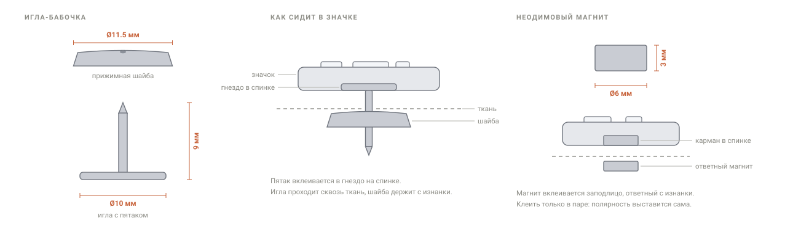

# Pin Forge

[English version](README.md)

SVG-логотип → STL значка или готовый проект Orca/Bambu с зашитым профилем
печати. Всё считается в браузере, файл никуда не уходит.

## Попробовать

### → [pin.gorskikh.com](https://pin.gorskikh.com)

Ничего ставить и регистрироваться не нужно. Брось SVG под превью — и значок
соберётся сам.


Интерфейс двуязычный, русский и английский, переключатель в шапке.

## Что он даёт

- **Тело под логотип** — круглая плашка, скруглённый прямоугольник или контур,
  вырезанный по самим буквам.
- **Гнездо под фурнитуру** — игла-бабочка или магнит: утопить, приклеить на
  площадку либо спрятать под напечатанной крышкой с паузой в печати.
- **Отверстие для брелока** — вместо гнезда: под разъёмное кольцо слева или
  справа, на свободном месте внутри плашки (прямоугольник под него удлиняется)
  или на ушке снаружи, которое вливается в плашку со скруглённым стыком;
  диаметр, ширина ободка и положение настраиваются.
- **Проверку на пропечатку** — минимальный штрих и просвет считаются под
  выбранную технологию, с картой мест, которые не выйдут, и конкретными
  подсказками, что подкрутить.
- **Тестовую плашку** — сетка 3×3 по размеру лого и высоте рельефа, чтобы за
  одну печать понять, какая комбинация выживает.

## Что крепим сзади



Генератор подгоняет гнездо под выбранную фурнитуру, ищет ближайшую к центру
точку, где она реально помещается, и предупреждает, если не помещается.

## Требования к SVG

- текст переведён в кривые
- обводки конвертированы в контуры (Illustrator: Object → Path → Stroke to Path)
- без `clipPath`, масок и `<use>`
- фигуры с заливкой, а не только stroke

## Настройки печати

**Скачать готовый проект.** Выбери формат `Проект Orca / Bambu (.3mf)`, и файл
приедет с профилем печати внутри: в слайсере ничего вбивать не нужно. Один раз
понадобится настройка, она описана ниже в разделе про экспорт 3mf.

**Или списать с экрана.** Раздел «Рекомендации печати» в интерфейсе показывает
все значения, которые генератор проставляет сам, с кнопкой копирования. Это
путь для слайсеров вне семейства Bambu и Orca, а ещё когда хочется сначала
посмотреть, что именно поменяется.

Что меняется и зачем:

- **Слой 0.08 мм**, чтобы рельеф 0.48 мм делился на целое число слоёв, а не на
  дробное, которое слайсер округлит как ему удобнее.
- **Генератор стенок Arachne.** Штрих 0.85 мм это 2.02 линии. Классический
  положит две и полезет затыкать остаток gap-fill'ом, буквы пойдут волнами.
  Arachne растянет две линии до 0.425 и обойдётся без мусора.
- **Компенсации в паре:** отверстия +0.05 мм, контур −0.05 мм. Контрформы «e» и
  «o» не затягивает, наружный край остаётся чётким, соседние буквы не слипаются.
- **Мелкие периметры на 40 мм/с при пороге 2 мм.** Самое полезное поле во всём
  списке. По умолчанию оно выключено, и контрформы букв едут на полной скорости.
- **Ironing по верхним поверхностям,** чтобы верхушки букв были плоскими и
  глянцевыми и ровно принимали хром или воск.
- **Ускорения срезаны до 3000, по внешней стенке 1500.** Штатные у K1C за 10000,
  и на таких принтер успевает разогнаться и затормозить внутри одной буквы:
  углы скругляются, на прямых звон.
- **Обдув на полную со второго слоя.** При таком слое одна копия не успевает
  остыть.

Разбор по каждому значению лежит в [PRINT-SETTINGS.md](PRINT-SETTINGS.md).

## Что в репозитории

| Файл | Что это |
|---|---|
| `index.html` | весь генератор: разметка, стили, логика |
| `vendor/three.min.js` | three.js r128, превью и геометрия |
| `vendor/pako.min.js` | deflate для zip и 3mf |

Внешних сборок нет, транспиляции нет, правится прямо в файле.

## Как устроен код

Всё в одном `<script>` в конце `index.html`, по секциям:

- **разбор SVG** — `parseSVGtoRings`: сэмплирует пути через `getPointAtLength`,
  разбивает на подпути, применяет CTM. На выходе — массивы точек. Загруженный
  файл сначала проходит `sanitizeSVG`: логотип кладётся в документ, и без чистки
  сработали бы его собственные обработчики событий.
- **анализ** — `analyzeLogo`: пускает лучи по нормали внутрь и наружу контура,
  считает минимальную толщину штриха и минимальный просвет. Рисует карту
  тонких мест.
- **контур плашки** — `plateOutline`: растеризует буквы на canvas, раздувает
  обводкой с круглыми стыками (честный offset без самопересечений),
  обратно в вектор через marching squares с интерполяцией по альфе.
  Пересекающиеся буквы сливаются в один контур.
- **геометрия** — `buildPin`: тело, рельеф или врезка букв, гнездо под вставку,
  площадка на спинке.
- **размещение вставки** — `bestSpot`: ищет точку, ближайшую к центру, где
  вставка помещается; поиск ограничен центральной зоной.
- **центровка надписи** — `letterBandCenter`: берёт медиану вертикальных середин
  контуров как реальную высоту строки, поэтому выносной элемент вроде «t» больше
  не тянет слово вверх. Сдвиг зажат так, чтобы логотип не вышел за плашку.
- **экспорт** — `toBinarySTL`, `make3MF`, `makeZip` (свой писатель zip
  с deflate и UTF-8 в именах).
- **локализация** — `I18N` держит оба словаря, `t()` достаёт строку по ключу,
  `applyLang()` проходит по атрибутам `data-i18n` и перерисовывает всё
  динамическое. Русский словарь считается полным: если ключа нет в английском,
  подставится русский.

## Технологии

Пороги минимального штриха и просвета зависят от выбранной технологии
(`TECH` в коде). Для FDM генератор ещё подсказывает, как подогнать штрих
под целое число периметров.

## Экспорт 3mf

Слайсеры семейства Bambu и Orca применяют настройки из проекта только при двух
условиях. Модель должна объявить себя их проектом, это теперь делается, и
профиль внутри должен быть **полным**. Частичный профиль выбрасывается молча,
а `inherits` здесь не работает, так что сослаться на установленный пресет
не выйдет. Проверено на Creality Print.

Полный профиль генератор придумать не может: он не знает, какие пресеты у тебя
стоят. Поэтому он берёт твой. Сохрани в слайсере любой проект командой
«Сохранить проект как», укажи этот файл в поле **Базовый профиль** в разделе
экспорта, и дальше каждый `.3mf` поедет с твоим профилем целиком, а наши
значения подменятся внутри: слой, Arachne, компенсации, скорости, ускорения,
ironing, scarf joint и обдув. Пресеты принтера, стола и пластика останутся
ровно теми, что были в твоём файле.

Профиль вынимается прямо из `.3mf` в браузере и хранится локально. Обычный
`.json` с процессом тоже подойдёт. Без базового профиля экспорт по-прежнему
несёт геометрию и наши настройки, но слайсер их, скорее всего, проигнорирует,
и останется раздел «Рекомендации печати».

## Как добавить язык

1. Добавить третий ключ рядом с `ru` и `en` в `I18N`.
2. Добавить кнопку в группу `.lang` в шапке с нужным `data-lang`.
3. Всё, что не перевели, подхватится из русского.

## Запуск локально

Просто открыть `index.html` в браузере. Библиотеки лежат в `vendor/`,
интернет не нужен.

Если браузер ругается на локальные файлы (редко, зависит от настроек):

```bash
python3 -m http.server 8000
# открыть http://localhost:8000
```

## Как развернуть у себя

Страница статическая, подойдёт любой веб-сервер или статический хостинг.
Положи `index.html` и папку `vendor/` в корень сайта и направь туда домен.
Собирать нечего, рантайма и бэкенда нет.

## Лицензия

Пока не выбрана. Перед переиспользованием спроси.
